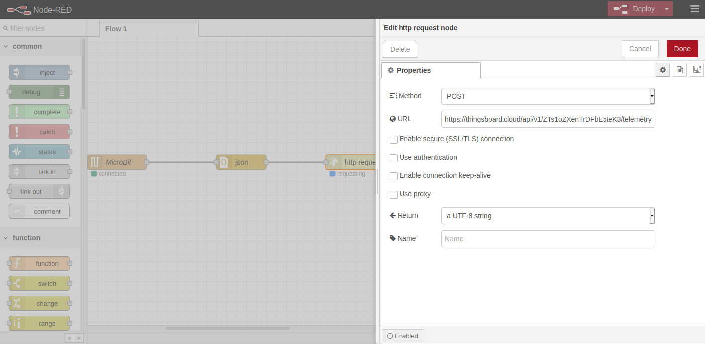
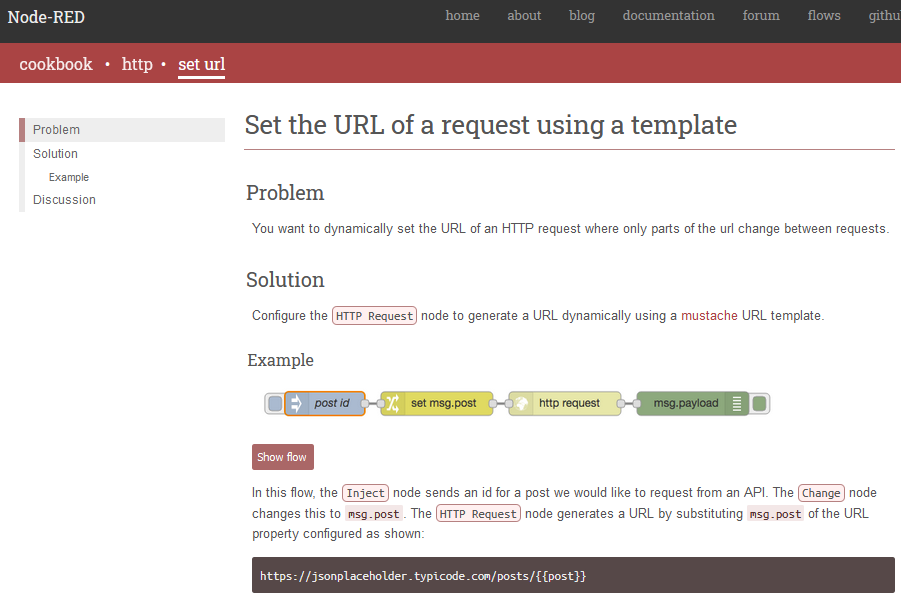

# Table of Contents

1.  [Introduction](#org0c68ea8)
    1.  [General Overview](#orga64e84e)
2.  [Growhouse](#orgc0cd2bb)
    1.  [Sensors](#orgccccdab)
    2.  [Output systems](#orgbae4667)
3.  [Micro:bit](#org08f8e7c)
    1.  [Mapping of pins](#orgee737e6)
    2.  [Makecode code](#org0b79786)
4.  [Raspberry Pi](#org6991e02)
5.  [ThingsBoard](#orga65812d)
    1.  [User Administration](#orgb7d7e6c)
    2.  [Connection options](#org7f3723a)
    3.  [Data handling & Rule Chain](#org36275f5)
    4.  [Device](#org2942e9c)
    5.  [Dashboard](#org31ac432)
    6.  [Downlink](#org8f7cd95)

# Introduction

This document contains results from our work on the IoT-Growhouse project.

## General Overview

Our growhouse is controled by a (or several) microbits, that sends and receives all data to our IoT platform through a Raspberry Pi. There are several other options (modules for the microbit), that will let it 
\newline
\newline
 ****The system architecture, mapping all device and their usage, looks the following:****
 

\newpage

# Growhouse

## Sensors

These are the current sensors used to collect and send in data to our IoT platform.

## Output systems

# Micro:bit

## Mapping of pins

Here we show the pins in use and their purpose. The offical mapping for what the pins can be used for, is [found here](https://makecode.microbit.org/device/pins).

-   ****Relay Pins****
    -   0:
    -   1:
    -   2:
    -   3:
    -   4:
    -   5:
    -   6:
    -   7:

-   ****Pins****
    -   0:
    -   1:
    -   2:
    -   3:
    -   4:
    -   5:
    -   6:
    -   7:
    -   8:
    -   9:
    -   10:
    -   11:
    -   12:
    -   13:
    -   14:
    -   15:

## Makecode code

Current code running on our gateway microbit.

# Raspberry Pi

This device ****is optional****, and can be skipped if setting up the the micro:bit to send POST requests through a ESP8226 module. ThingsBoard also have many other integration options, that can be used to connect devices.
\newline
\newline
It is connected to WiFi and running a Node-RED server:

1.  Receive string from microbit
2.  Parse string to JSON
3.  Send JSON to ThingsBoard, using HTTP POST request
    -   URL (includes device token):

We can add extra functionality to our Node-RED server, that makes it inject the device id given to it by our microbit into the request URL. By doing so we can now use our microbit that is connected to the Raspberry Pi as a gateway for other devices (most likely other microbits). These other microbits can use bluetooth (BT) to send in data to ThingsBoard, through our microbit gateway.

# ThingsBoard

It is possible to use ThingsBoard (TB)with the free Community Edition (CE) for our project, as we only need to use the HTTP API and not one of the available integrations that come with the Professional edition (PE). To simpliy and speed things up, we are using PE because it makes the ThingsBoard cloud installation available to us; saving us the job of setting up and configuring our own TB server.

## User Administration

Documentation on how a system administration can create and handle users is [found here](https://thingsboard.io/docs/user-guide/ui/tenants/). In our case we will create a Costumer for each school. Each Costumer have their own set of users, assets, devices, dashboards, and so on. We create on "Tenant Administrator" for each school, that have the authorization to create and do everything needed to fully utilize the ThingsBoard platform. Scripts can be used to automate the creation of costomers, and set up default things we wish them to have at start.

Dashboards can be created through the GUI or code. Here are some scripts &#x2026;. TODO that can be used to quickly set up the default Dashboard for our Growhouse.

## Connection options

## Data handling & Rule Chain

## Device

We have created one device, that represents the microbit mounted on our IoT-Growhouse. We send all data from the growhouse using a single HTTP POST request. When the request has gone through the Root rule chain, where data from devices gets saved, we can see it on our device. Then we can connect and display values of each key (in the JSON data the device receives) in Dashboard Widgets.

## Dashboard

Here is an example dashboard, showing sensor data received from our growhouse:

## Downlink

-   TODO: We are currently not doing this

